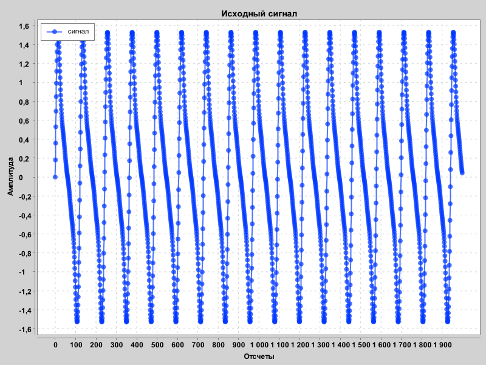
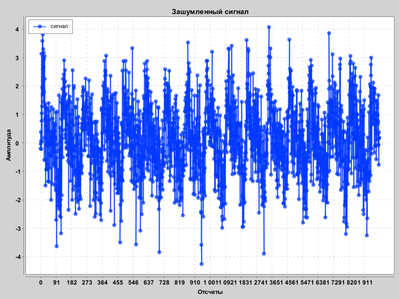
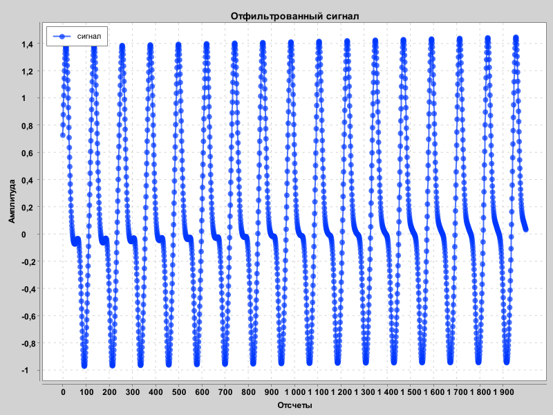

# Моделирование 1 "фильтрация"

## Описание:
Данная работа содержит реализацию двух алгоритмов:
1.  Фильтрация и зашумление аудиосигнала с использованием Быстрого Преобразования Фурье, а также периодического шума.
2.  Фильтрация и зашумление изображения с помощью медианного фильтра.

---

## Часть 1: аудиосигналы

### Смысл Преобразования Фурье в данной работе

Преобразование Фурье — это алгоритм предназначенный для того чтобы преоборазовывать сигнал из временной области в частотную и обратно. Тем самым он позволяет анализировать сигнал, например для нахождения каких-либо аномалий или шума. 

**Зачем это нужно для фильтрации?**

1.  Диагностика в частотной области: После преобразования мы видим не просто волну во времени, а спектр сигнала. На этом спектре хорошо виден как полезный сигнал, так и шум.
2.  Простая фильтрация: Имея спектр, становится легко отделить какой-либо шум от чистого сигнала. В данной работе мы используем пороговый фильтр, то есть предполагаем, что компоненты с малой амплитудой являются шумом, и просто удаляем их. Компоненты сигнала, у которых высокая амплитуда, мы считаем полезным сигналом.
3.  Обратное преобразование: После очистки спектра мы выполняем обратное преобразование Фурье, которое собирает отфильтрованные частоты обратно в сигнал. В результате мы получаем сигнал, но уже без шума.

### Процесс работы:

1.  **Загрузка сигнала:**
Программа дает на выбор два варианта взаимодействия:
    - загрузить внешний сигнал из бинарного файла `signal_2.npy` с помощью кастомного парсера.
    - сгенерировать чистый сигнал параметрами из 

2.  **Добавление шума:**
    *   К сгенерированному чистому сигналу добавляется белый шум.
    *   К такому же сигналу добавляется периодический шум

3.  **Фильтрация:**
    *   Зашумленный сигнал обрабатывается БПФ-фильтром, который обнуляет частотные компоненты с амплитудой ниже определенного порога.

4.  **Визуализация сигналов:**
    *   Программа генерирует и сохраняет изображения с графиками сигналов.

    **Исходный сигнал:**
    

    **Зашумленный сигнал:**
    

    **Отфильтрованный сигнал:**
    

5.  **Воспроизведение:**
    *   Программа последовательно воспроизводит исходный, зашумленный и отфильтрованный сигналы.
---

## Часть 2: Обработка изображений

### Процесс работы:
Программа загружает изображение, добавляет к нему случайный импульсный шум и затем очищает его с помощью медианного фильтра.

1.  **Загрузка изображения:**
    *   Программа загружает файл `input.jpg` из папки ресурсов.

2.  **Добавление шума:**
    *   С заданной вероятностью для каждого пикселя изображения генерируется случайное значение интенсивности шума. Это значение затем либо прибавляется к цветовым компонентам пикселя, либо вычитается из них.

3.  **Медианная фильтрация:**
    *   Для каждого пикселя изображения выбирается окно, например, 3x3.
    *   Значения цветов (R, G, B) всех пикселей в окне сортируются.
    *   Новым значением центрального пикселя становится медианное (серединное) значение из отсортированного списка.

4.  **Сохранение:**
    *   Программа сохраняет два файла: `noisy.jpg` (зашумленное изображение) и `filtered.jpg` (результат после фильтрации).

